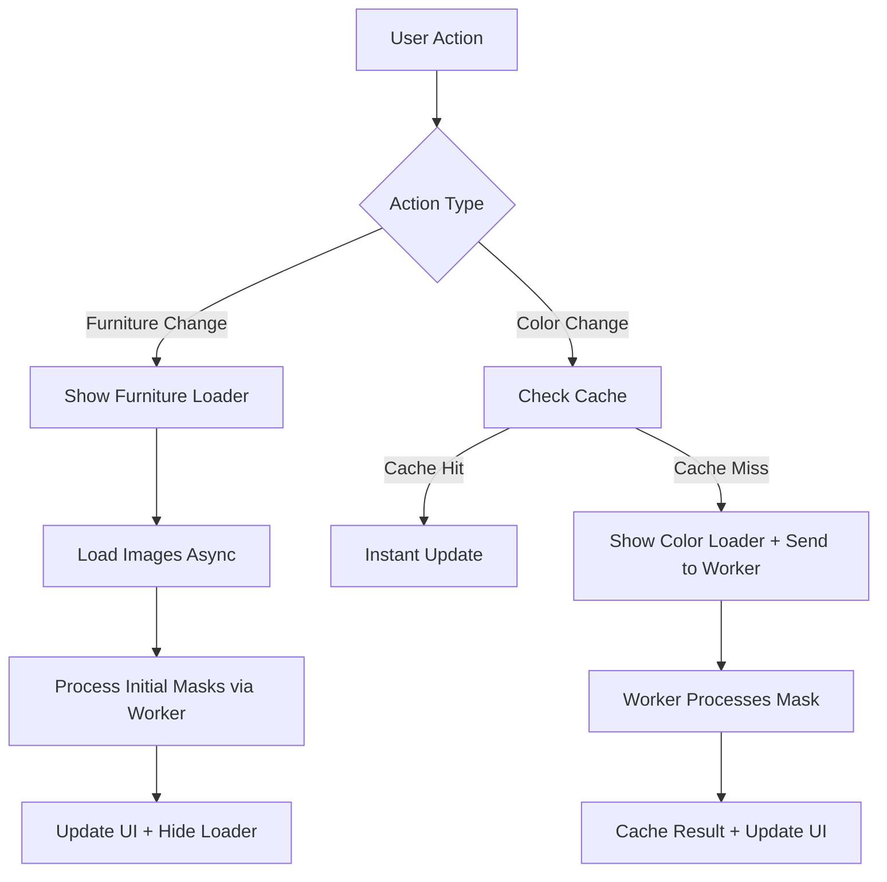

# Performance Optimization Plan for InteractiveShowroom.tsx

## Current Issues Identified

1. **Heavy Synchronous Processing**: The `processMaskWithPalette` function performs pixel-level manipulation on large canvases (up to 565x565 pixels) in the main thread, causing UI freezes during color changes.

2. **No Caching**: Processed masks are recalculated every time a color changes, even for identical combinations.

3. **Global Loading State Only**: Only initial furniture loading shows a loader; color changes happen without feedback, making the app feel unresponsive.

4. **Large Image Sizes**: Using high-resolution images (upscayl 4x webp) increases loading and processing time.

5. **No Debouncing**: Rapid color changes trigger multiple expensive operations.

## Recommended Solutions

### 1. Web Workers for Image Processing
- **Why**: Offloads heavy pixel manipulation to a background thread, preventing UI blocking.
- **Implementation**: Create a dedicated worker for mask processing using Comlink or native Web Workers.
- **Benefits**: Smooth UI during processing, better user experience.

### 2. Mask Caching System
- **Why**: Avoids re-processing identical mask-color combinations.
- **Implementation**: Use a Map with keys like `${maskUrl}-${colorId}-${materialType}` to cache processed canvases.
- **Benefits**: Instant color changes for previously processed combinations.

### 3. Granular Loading States
- **Why**: Provides immediate feedback for user actions.
- **Implementation**: Add separate loading indicators for:
  - Furniture switching
  - Color changes (fabric, wood, tabletop)
- **Benefits**: Perceived performance improvement, user knows something is happening.

### 4. Image Loading Optimizations
- **Why**: Reduces initial load times and processing overhead.
- **Implementation**:
  - Use progressive JPEG/WebP loading
  - Consider smaller base images with upscaling on demand
  - Lazy load non-critical images

### 5. Debouncing and Throttling
- **Why**: Prevents excessive processing during rapid user interactions.
- **Implementation**: Debounce color selection handlers by 200-300ms.
- **Benefits**: Reduces unnecessary computations.

## Architecture Diagram

## Implementation Priority

1. **High Priority**: Web Workers + Caching (addresses core blocking issue)
2. **Medium Priority**: Granular Loaders (improves UX immediately)
3. **Low Priority**: Image Optimizations + Debouncing (fine-tuning)

## Expected Outcomes

- **UI Responsiveness**: No more browser freezing during color changes
- **Faster Interactions**: Cached masks provide instant feedback
- **Better UX**: Clear loading states keep users informed
- **Scalability**: Workers allow for more complex processing if needed

## Potential Challenges

- Web Worker setup complexity in Vite environment
- Memory usage with cached canvases (need cleanup strategy)
- Browser compatibility for advanced features

## Next Steps

Review this plan and approve to proceed with implementation. The first step will be setting up the Web Worker infrastructure for mask processing.