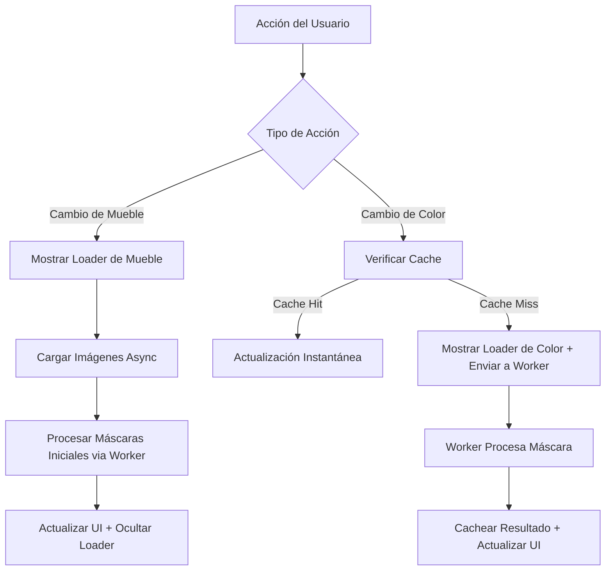

# Plan de Optimización de Rendimiento para InteractiveShowroom.tsx

## Problemas Actuales Identificados

1. **Procesamiento Sincronico Pesado**: La función `processMaskWithPalette` realiza manipulación de píxeles en canvases grandes (hasta 565x565 píxeles) en el hilo principal, causando congelamientos de la UI durante cambios de color.

2. **Sin Cache**: Las máscaras procesadas se recalculan cada vez que cambia un color, incluso para combinaciones idénticas.

3. **Estado de Carga Global Únicamente**: Solo la carga inicial del mueble muestra un loader; los cambios de color ocurren sin retroalimentación, haciendo que la app se sienta poco responsiva.

4. **Tamaños de Imagen Grandes**: Uso de imágenes de alta resolución (upscayl 4x webp) aumenta el tiempo de carga y procesamiento.

5. **Sin Debouncing**: Cambios rápidos de color activan múltiples operaciones costosas.

## Soluciones Recomendadas

### 1. Web Workers para Procesamiento de Imágenes
- **Por qué**: Descarga el procesamiento pesado de píxeles a un hilo en segundo plano, previniendo bloqueos de UI.
- **Implementación**: Crear un worker dedicado para procesamiento de máscaras usando Comlink o Web Workers nativos.
- **Beneficios**: UI fluida durante el procesamiento, mejor experiencia de usuario.

### 2. Sistema de Cache de Máscaras
- **Por qué**: Evita re-procesar combinaciones idénticas de máscara-color.
- **Implementación**: Usar un Map con claves como `${maskUrl}-${colorId}-${materialType}` para cachear canvases procesados.
- **Beneficios**: Cambios de color instantáneos para combinaciones previamente procesadas.

### 3. Estados de Carga Granulares
- **Por qué**: Proporciona retroalimentación inmediata para acciones del usuario.
- **Implementación**: Agregar indicadores de carga separados para:
  - Cambio de muebles
  - Cambios de color (tela, madera, superficie de mesa)
- **Beneficios**: Mejora la percepción de rendimiento, el usuario sabe que algo está sucediendo.

### 4. Optimizaciones de Carga de Imágenes
- **Por qué**: Reduce tiempos de carga inicial y sobrecarga de procesamiento.
- **Implementación**:
  - Usar carga progresiva JPEG/WebP
  - Considerar imágenes base más pequeñas con escalado bajo demanda
  - Carga lazy para imágenes no críticas

### 5. Debouncing y Throttling
- **Por qué**: Previene procesamiento excesivo durante interacciones rápidas del usuario.
- **Implementación**: Debounce en handlers de selección de color por 200-300ms.
- **Beneficios**: Reduce computaciones innecesarias.

## Diagrama de Arquitectura

## Prioridad de Implementación

1. **Alta Prioridad**: Web Workers + Cache (aborda el problema central de bloqueo)
2. **Media Prioridad**: Loaders Granulares (mejora UX inmediatamente)
3. **Baja Prioridad**: Optimizaciones de Imágenes + Debouncing (ajuste fino)

## Resultados Esperados

- **Responsividad de UI**: No más congelamientos del navegador durante cambios de color
- **Interacciones Más Rápidas**: Máscaras cacheadas proporcionan retroalimentación instantánea
- **Mejor UX**: Estados de carga claros mantienen informados a los usuarios
- **Escalabilidad**: Workers permiten procesamiento más complejo si es necesario

## Desafíos Potenciales

- Complejidad de configuración de Web Worker en entorno Vite
- Uso de memoria con canvases cacheados (necesita estrategia de limpieza)
- Compatibilidad de navegador para características avanzadas

## Próximos Pasos

Revisar este plan y aprobar para proceder con la implementación. El primer paso será configurar la infraestructura de Web Worker para procesamiento de máscaras.